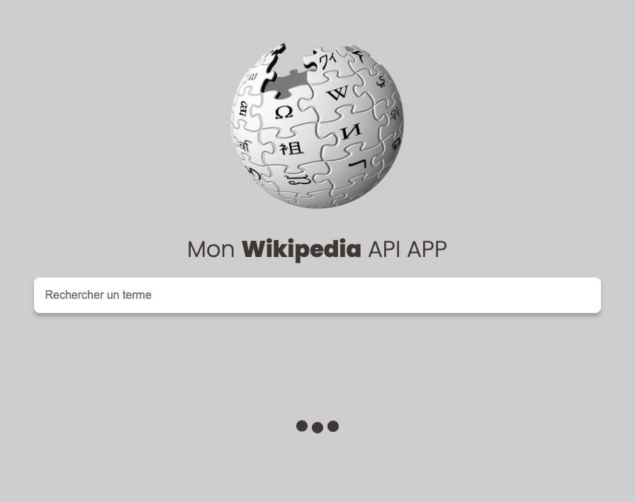
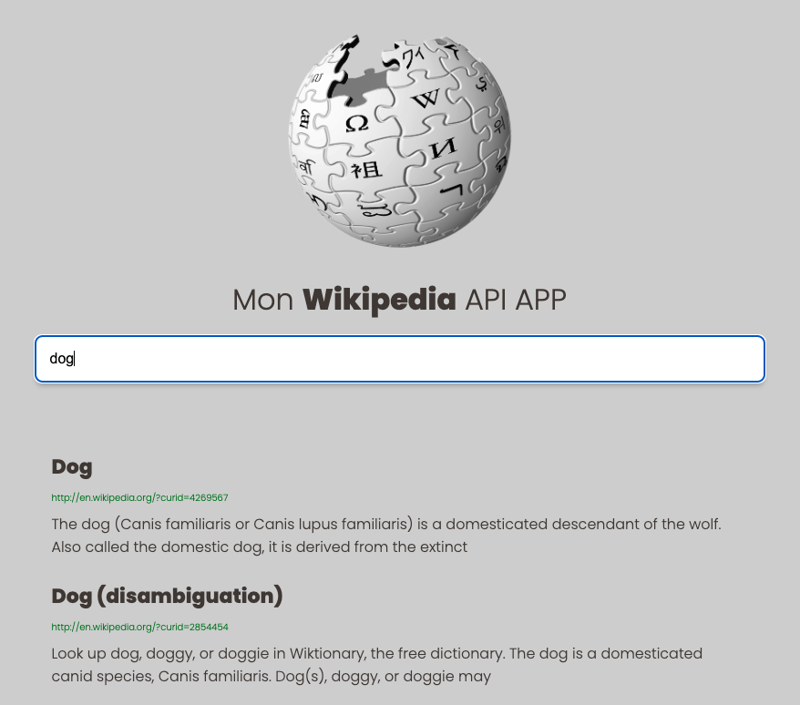

# Wikipedia App 

This is a demo of [Le Designer du Web](https://www.youtube.com/@LeDesignerduWeb), which helped me to improve my JavaScript skills by building a realistic app.

## Screenshot

## Built with

- Semantic HTML5 markup
- CSS
- Mobile-first workflow
- JavaScript
